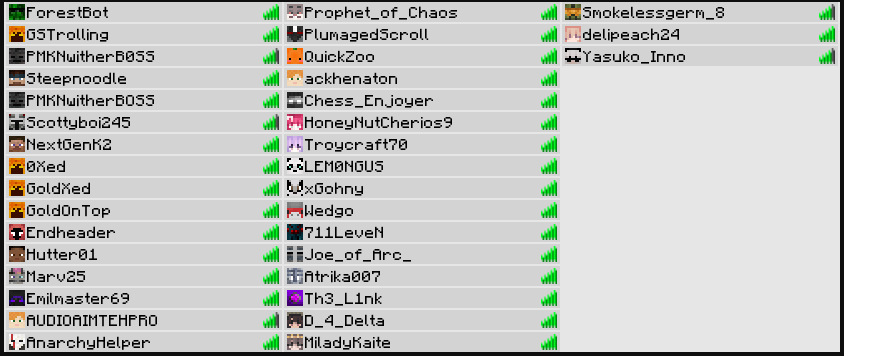

# Mineflayer Playerlist Tablist Generator

A simple package that generates a PNG image Encoded in Base64 of the Minecraft server tablist for Mineflayer bots.

## Example



<br>
<br>

## Installation

``` npm install mineflayer-playerlist ``` <br>
or <br>
``` yarn add mineflayer-playerlist ```

<br>
<br>

## Usage

Typescript Example:
```ts
import { generateTablist, PlayerList } from "mineflayer-playerlist";

const playerList: PlayerList[] = [
    { name: "player1", ping: 10 },
    { name: "player2", ping: 50 },
    { name: "player3", ping: 200 },
];

const tablistImage = await generateTablist(playerList);
console.log(tablistImage);
```
The function returns a Promise that resolves to the generated PNG image encoded in Base64.

<br>
<br>

## API

### `generateTablist(players: PlayerList[]): Promise<string>`

Use this function to generate a PNG image encoded in Base64 for a Minecraft server tablist.

**Parameters**

`players`: An array of player objects. Each player object should have a `name` and a `ping` property.

**Return Value**

A `Promise` that resolves to the generated PNG image encoded in Base64.

**Types**

`PlayerList`

```ts
type PlayerList = {
  name: string;
  ping: number;
};
```

An object representing a player in the tablist. The `name` property should be a string and the `ping` property should be a number representing the player's latency in milliseconds.

